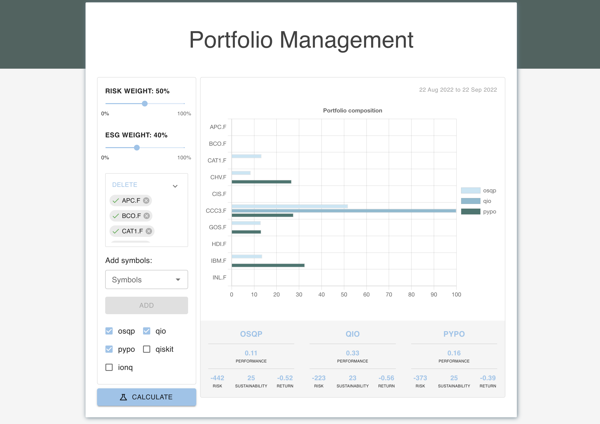

# Archived Repository

The Qiskit APIs have changed a lot in the last years, therefore the existing repository might not build and integrated with the Quantum Hardware anymore. Therefore the repository was archived.

# Quantum Portfolio Optimization (QUPO)

This prototype addresses two questions:

- Quantum computers are often described as a more efficient way to solve complex problems. But are they actually capable of doing so or is this still a dream of the future?

- Optimizing the composition of a stock portfolio according to parameters like turnover or risk is a non-linear problem and usually can only be solved by approximation methods ("Monte Carlo"). The reason is the combinatorial explosion of the many possibilities how the portfolio could be composed, so that a classical computer would have to calculate all possibilities for the optimal solution - the number of possibilities is so huge that this is not possible in a manageable time. This is comparable to calculating all possible chess positions with a computer opponent - strategies and approximate solutions are also used there. Quantum computers promise to evaluate the numerous possible solutions in a fraction of the time.

This raises the question whether the optimization of a stock portfolio with the help of a quantum computer could include further parameters, which are currently not included due to the explosion of possibilities.

**Proposed solution**



The prototype uses a portfolio of assets that can be chosen arbitrarily. In addition to the dimensions "turnover" and "risk" (variance), the dimension "sustainability" is added. For this, a sustainability score from the ESG database is added for each asset. Thus, there are significantly more options for the composition of an optimal portfolio. The solution includes the following aspects:

- How do quantum solvers from IBM (Qiskit), Microsoft (Azure Quantum) and IonQ perform compared to a classical solver using the PyPortfolio library?
- How can the result be appealing and interactive in a user interface that invites experimentation?
- Can the prototype be extended as a platform that is made available as open source and can thus be used for co-creation?

A platform for portfolio optimization using quantum and non quantum (classical) algorithms. The repository includes an `api` folder which contains the python backend that is responsible for the portfolio calculations. It is connected to a ReactJs frontend.

## Getting started

The application is composed of two parts which are required to be started separately. Before starting, please make sure you have at least Python 3.9 installed and your `python3` command points to the version 3.9 or higher.

### Quick Start

Try the quick start guide to run the application. For an installation from scratch on Ubuntu see [below](#install-from-scratch-on-an-empty-ubuntu-os). The application can also be started with docker or docker compose, navigate to the respective [installation guide](#start-app-with-docker-files) to the end of the page.

#### API / Backend

1. Create and activate virtual environment:

   ```(bash)
   cd ./api
   python3.10 -m venv ./venv
   source ./venv/bin/activate
   ```

1. Install the requirements:

   ```(bash)
   pip install -r requirements.txt
   ```

1. Create the `.env` file and set the environment variables (further information on the env variables in the [README](./api/README.md#environment-variables) of the backend):

   ```(bash)
   cp .env_example .env
   ```

1. Start the backend service:

   ```(bash)
   ./start_dev.sh
   ```

To verify that the backend is running, the following URL can be used: <http://localhost:8000/health>.

#### Frontend

1. Navigate to the frontend folder and create the `.env` file:

   ```(bash)
   cd ./frontend
   cp .env_example .env
   ```

1. Install the npm scripts and start the app:

   ```bash
   npm install
   npm start
   ```

The application should now be running on <http://localhost:3000>.

### Install from scratch on an empty Ubuntu OS

First, we clone the repository and get the API/backend running using python. Afterwards, we take care about the frontend. Make sure that the server is accessible and port 8000 open in the firewall.

#### Installation of the API / Backend

```(bash)
git clone https://github.com/openkfw/qupo.git
```

Change to the api folder first, we do frontend later

```(bash)
cd qupo/api
```

Copy the example env file and edit the respective keys if you have them:

```(bash)
cp .env_example .env
```

Make sure the python 10 repository is available:

```(bash)
sudo add-apt-repository ppa:deadsnakes/ppa
```

Update the repo and upgrade if needed

```(bash)
sudo apt update && sudo apt upgrade
```

Install python version 10

```(bash)
sudo apt install software-properties-common -y
```

```(bash)
sudo apt install python3.10
```

Python should be installed now, which you can check with the version flag

```(bash)
python3.10 --version
```

Now install the pip package manager

```(bash)
sudo apt install python3-pip
```

To use a virtual environment (important for python, which is a mess without virtual environments), use this command

```(bash)
sudo pip3 install virtualenv
```

Create a virtual environment with the respective python version

```(bash)
virtualenv --python="/usr/bin/python3.10" "./venv"
```

Activate the environment

```(bash)
source venv/bin/activate
```

Now install all required packages

```(bash)
pip install -r requirements.txt
```

Using uvicorn, the API should be able to start now

```(bash)
uvicorn qupo_backend.main:app --host 0.0.0.0 --port 8000 --reload
```

The API should be available now, which you can test with

```(bash)
wget <server>:8000/health
```

#### Installation of the frontend

The frontend is a react application which can be compiled into a static web page. For a simple setup, which is also suitable for development (hot-reload) and changes, the following steps can be done. This should **not** be used in a productive setup, but should illustrate the steps required to run the architecture.

Install the node version manager to be able to use the respective node version:

Change into the frontend folder of the project

```(bash)
cd ./frontend
```

Copy the example environment file. It points the frontend UI to the respective API server, for simplicity, we assume that it is running on the same server. In this case, no change is needed

```(bash)
cp .env_example .env
```

Install the node version manager

```(bash)
curl https://raw.githubusercontent.com/creationix/nvm/master/install.sh | bash
```

Restart the shell session or reload bashrc.

Install node server version 17.x

```(bash)
nvm install 17.8.0
```

On initial start-up, first install all required packages from the `package.json` file. Then you can run the app with:

```bash
npm install
npm start
```

In your server visit [http://localhost:3000](http://localhost:3000) to see the app up and running. If the frontend is running on another server, replace the respective server name.

### Install Python >3.9 and openblas using MacOS

https://www.python.org/downloads/
openblas on MacOS (via homebrew):

```(bash)
   /bin/bash -c "$(curl -fsSL https://raw.githubusercontent.com/Homebrew/install/HEAD/install.sh)"
```

```(bash)
   brew install python3
```

```(bash)
   brew install openblas
```

and follow the instructions to configure compilers

## Start app with docker files

The repository includes docker files for the api service as well as for the frontend. You can either start them individually (see respective READMEs) or use the `docker-compose.yml` file to start them together.

1. Make sure to navigate to the root folder, where the `docker-compose.yml` file is located.

1. Set environment variables:

   **For the frontend:**

   ```(bash)
   cp ./frontend/.env_example frontend.env
   ```

   For running the application within docker container set the `REACT_APP_API_URL` environment variable to `http://api:8000`.

   **For the backend:**

   ```(bash)
   cp ./api/.env_example api.env
   ```

   The environment variables for the backend are the same as for the local deployment.

1. In your bash run the docker containers with:

   ```(bash)
   docker compose up
   ```

Now the application should be up and running. You can view it on your browser at [http://localhost:8001](http://localhost:8001).
