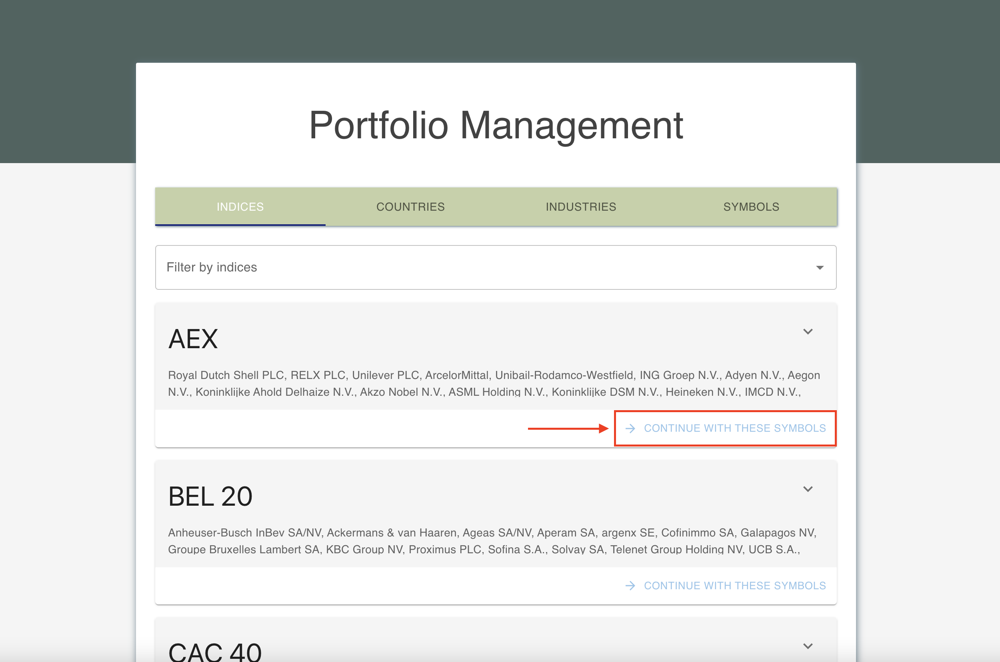
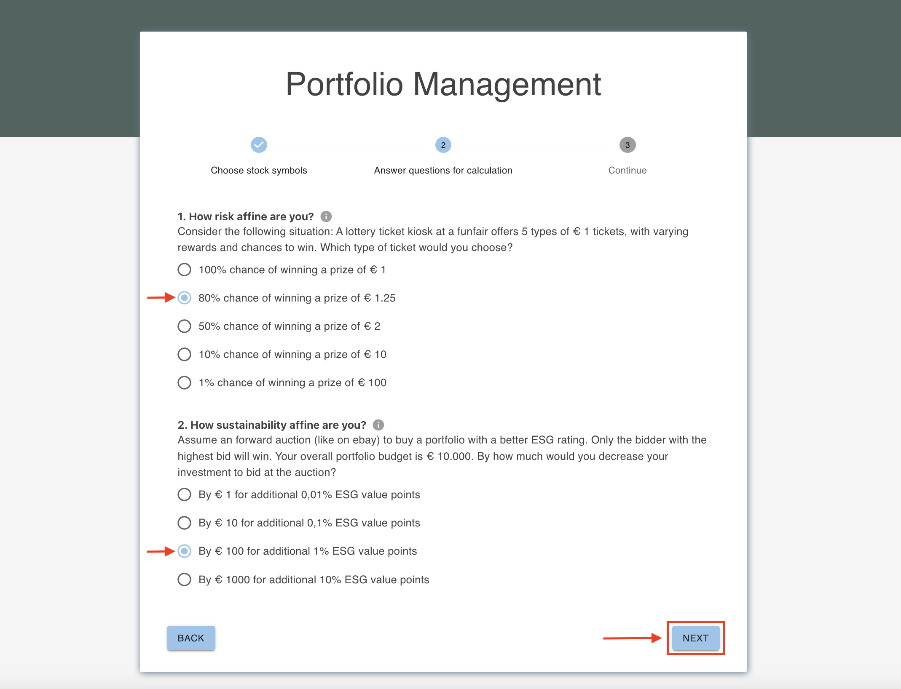
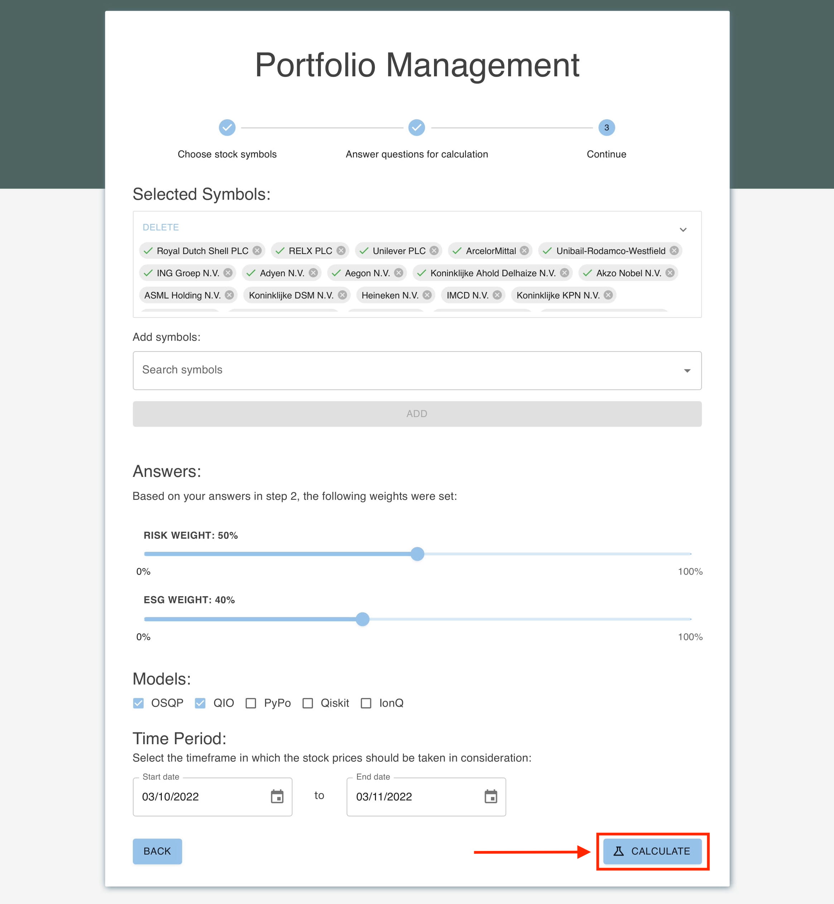
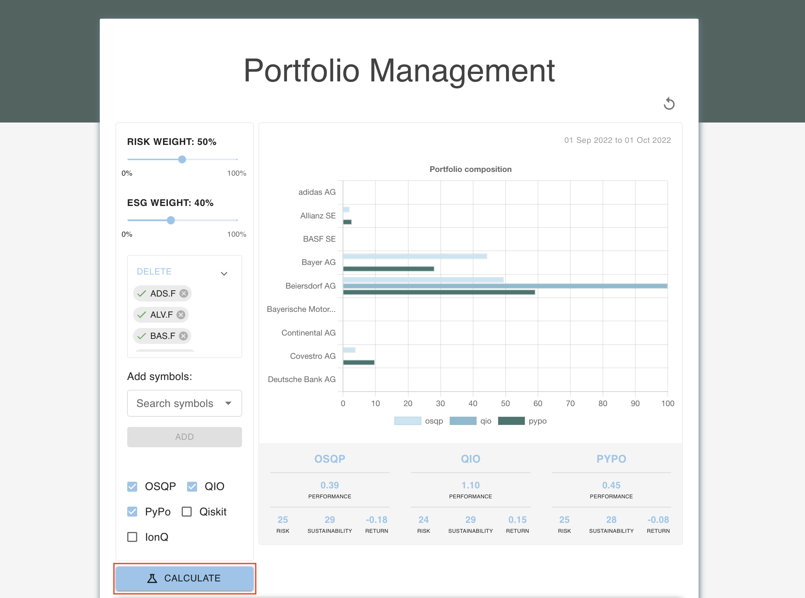

# User Guide

The QuPO application calculates a portfolio of a given set of stocks with the two constraints `risk` and `sustainability` using five different kinds of algorithms and makes them comparable with one another.

Links to other docs:

- [QuPO Architecture](./arch/README.md)
- [Database Structure](./db/README.md)
- [Use Case: Portfolio Optimization](./portfolio_optimization/README.md)

# How to use the application

The initial start page of the application shows an overview of stock collections grouped by their index, country or industry. To choose a whole set of stocks, pick a collection and `Continue with these symbols`. Or choose the symbols individually by changing to the `SYMBOLS` tab.

Then the process is started and the application leades you to a page asking you questions about your risk and sustainability affinity. By answering these questions weights are set which are being used to calculate the portfolio and weigh the results by giving risk and sustainability more/less importance depending on your answers.

