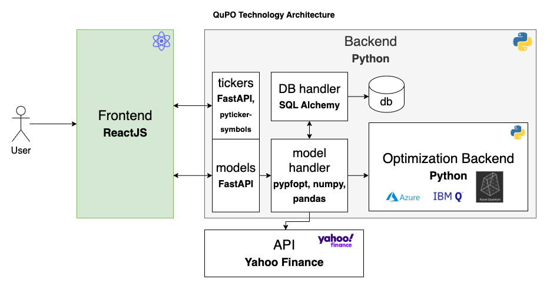
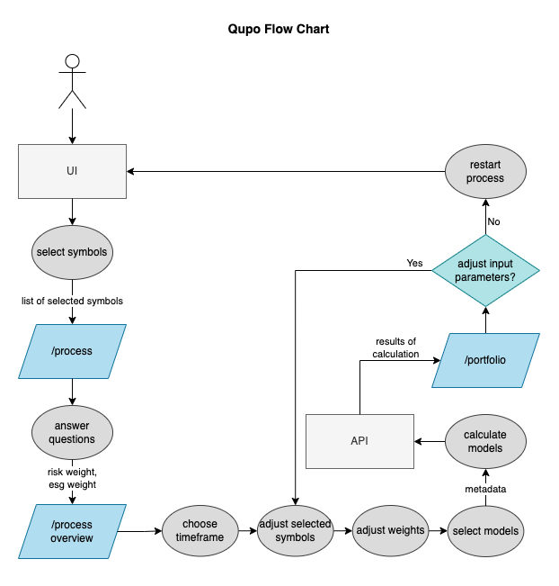
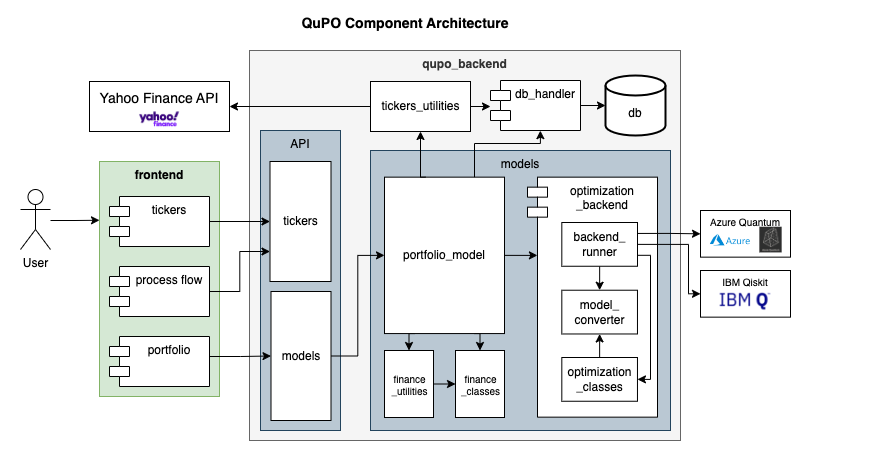
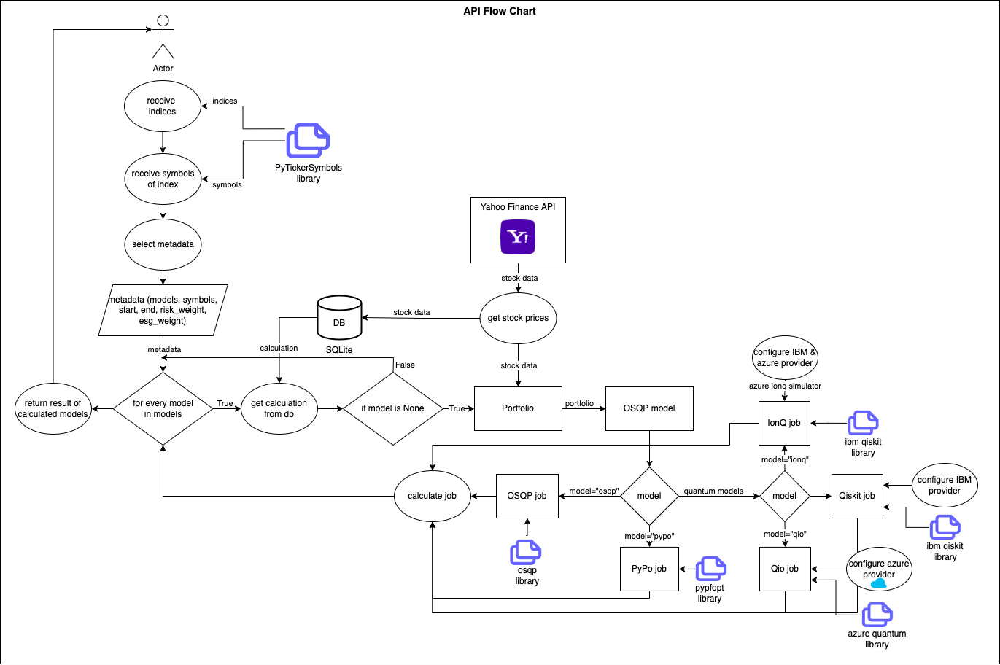

# QuPO Architecture

The application consists of a ReactJS frontend which is connected to a Python backend. The backend exposes two types of api endpoints: `tickers` and `models`. While the tickers api endpoint handles all requests regarding the stocks, its symbols and company names, the models endpoint accepts the requested problem with all its input parameters, formulates the job which is calculated by the optimization backend and then returned to the user as the optimal result of the portfolio.



The data for calculating the portfolio is fetched from the Yahoo Finance API. Therefore, the QuPO application can obtain historical data for various stocks as shown on Yahoo Finance: <https://finance.yahoo.com/>. Once downloaded, the data is saved to the database, see the [Documentation of the Database Model](../db/README.md) for further information.

## The Frontend

The frontend is a simple service initiated by [Create React App](https://github.com/facebook/create-react-app). It provides the User Interface to calculate various portfolios with five different algorithms taking constraints in consideration like the risk that we are willing to take and the sustainability factor that we want to include.

Therefore, the user first chooses a set of symbols, then defines how important the constraints are for themselves by answering questions and after setting a view more parameters like the timeframe of the stock prices and the models, the portfolio is calculated with the algorithms that the user chose for the models by making an api request. The backend calculates the portfolio and sends back the results to the frontend.



## The Backend

The following architectural component diagram shows the backend in its detailed parts:



The python service is called `qupo_backend` which exposes two types of api endpoints:

- `tickers` (including `/symbols`, `/indices` and `/industries`): It uses the python package `pytickersymbols` to retrieve symbols of companies grouped either according to their index, their country or their industry. The option parameter `symbols_only` hereby defines if only the plain symbols in a List or the symbols together with information like the company name, the currency or some other metadata as objects in a List should be returned.

- `models` (calculation of all classical and quantum models):
  The requests to calculate the portfolio with all its input parameters are send here. A request may look like the following example:

```bash
curl --location --request POST 'http://localhost:8000/models' \
--header 'Content-Type: application/json' \
--data-raw '{
    "models": ["osqp", "pypo"],
    "symbols": ["ADS.F", "ALV.F", "BAYN.F",  "BEI.F"],
    "risk_weight": 10,
    "esg_weight": 10,
    "start": "2022-08-01",
    "end": "2022-10-10"
}'
```

This starts the calculations depending on the `models` parameter. Once the service is done calculating the various portfolio models, the results are returned and send to the frontend. The object that is returned may look like the following example:

```JSON
[
    {
        "Calculation": {
            "model": "osqp",
            "symbols": [
                "ADS.F",
                "ALV.F",
                "BAYN.F",
                "BEI.F"
            ],
            "symbol_names": [
                "adidas AG",
                "Allianz SE",
                "Bayer AG",
                "Beiersdorf AG"
            ],
            "risk_weight": 10.0,
            "esg_weight": 10.0,
            "start": "2022-08-01",
            "end": "2022-10-10",
            "id": 147,
            "result": []
        },
        "Result": {
            "rate_of_return": {
                "ADS.F": 0.0,
                "ALV.F": 0.0,
                "BAYN.F": 34.27,
                "BEI.F": 65.73
            },
            "esg_rating": {
                "ADS.F": 13.46,
                "ALV.F": 16.72,
                "BAYN.F": 29.88,
                "BEI.F": 28.97
            },
            "volatility": {
                "ADS.F": 0.0025417845065472365,
                "ALV.F": 0.0013020043834552056,
                "BAYN.F": 0.006007783737555586,
                "BEI.F": 0.0022103124858540045
            },
            "objective_value": -1.2697567295179144,
            "rate_of_return_value": -0.23239186179309934,
            "risk": 25.873913818877377,
            "esg_value": 29.281880925170896,
            "id": 147,
            "calculation_id": 147
        }
    },
]
```

The `portfolio_model` component is therefore defining the problem and preparing it for the various algorithms. It gets the stock data from the `Yahoo Finance API` to retrieve on one hand the `Close` prices over a certain period of time and on the other hand the sustainability value of each stock that is requested. To prevent fetching this data again, it is saved to the database file and recalled when needed. For further information on the database read the [DB Documentation](../db/README.md).

The `optimization_backend` handles all the algorithms, identifies to the Azure Quantum and the IBM Qiskit APIs. For the classical algorithms it calls the `pypfopt` and the `osqp` libraries. Of each algorithm a result object is constructed which you can see in the above JSON object. Find further information on the result object and what each field means, in the [Portfolio Use Case Documentation](../portfolio_optimization/README.md#result).

The following Flow Chart visualizes the process from the api point of view to support the understandability of the QuPO backend.


