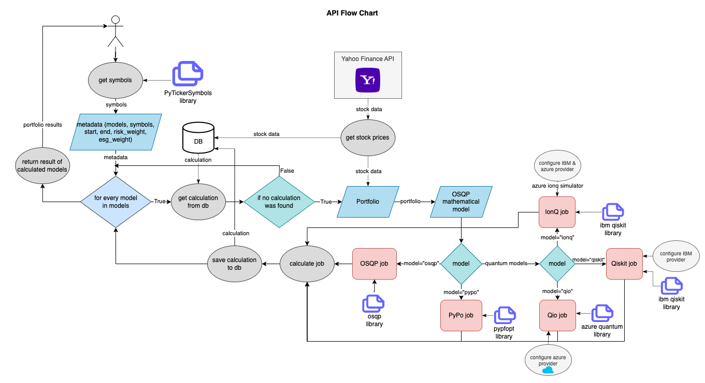

# QuPo Architecture

The application exists of a ReactJS Frontend which is connected to a python backend. The backend exposes two api endpoints: `tickers` and `main`. While the tickers api endpoint handles all requests regarding the stocks, its symbols and company names, the models api endpoint accepts the requested problem with all its input parameters, formulates the job which is calculated by the optimization backend and then returned to the user as the optimal result of the portfolio.

The data for calculating the portfolio is fetched from the Yahoo Finance API. Therefore, the QuPO application can obtain historical data for various stocks as shown on Yahoo Finance: [https://finance.yahoo.com/](https://finance.yahoo.com/). Once downloaded, the data is saved to the database, see the [Documentation of the Database Model](../db/README.md) for further information.

## Frontend

The frontend is a simple service initiated by [Create React App](https://github.com/facebook/create-react-app). It provides the User Interface to calculate various portfolios with five different algorithms taking as constraint the risk that we are willing to take and the sustainability weight that we support.

## Backend

