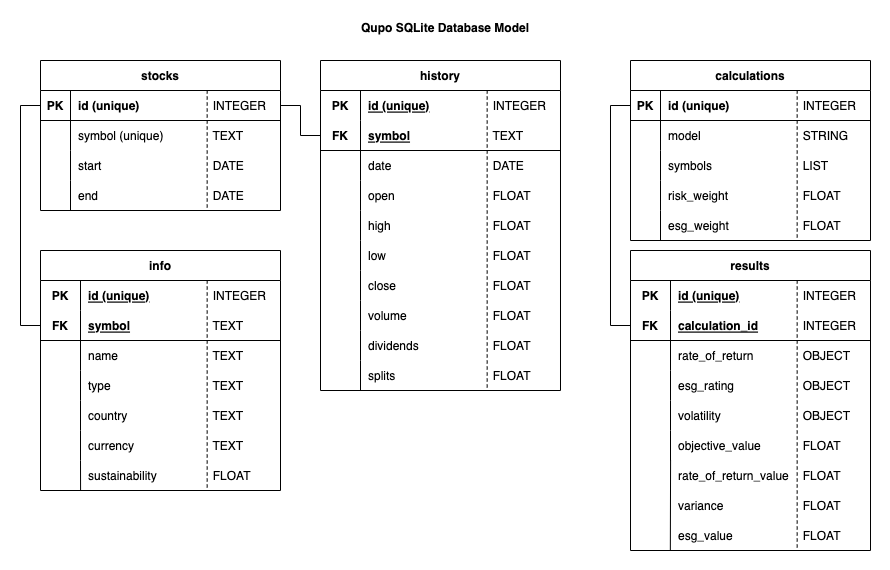
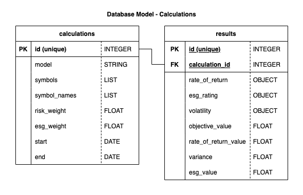

# Database

The QuPO application initiates an SQLite database on start-up when the config parameter `use_db` is set to `True` in `/api/qupo_backend/config.py`. It uses a local database file and saves stock data as well as the results of the calculated models. It minimizes the loading time of the application. If you don’t want to run the application with a database, set `use_db` to `False`. Expect significant loading times when using the app.

## Model Structure

There are two database models, one for the stocks and one for the calculations. The tables of these two models are not connected with each other. The following image shows the whole model structure:

### `Stocks`

The stocks model saves the fetched stock prices and the respective company’s information in the database. The data is received from the Yahoo Finance API. Each time a new stock is reflected in the portfolio, a fetch request is made to the Yahoo Finance API and saved to the database. If the stock is again requested in a later point of time, the data is taken from the database whereby fetching is avoided. However, the history data (stock prices) is regularly checked on new data and updated if needed.

See the model of the stocks database below. The `sustainability` value saved to the `info` table is taken in consideration for the ESG evaluation (see [ESG explanation](../portfolio_optimization/README.md#esg)). The calculation of the portfolio is based on the closing prices of a stock saved to the `history` table.

### `Calculations`

The `calculations` table saves all input parameters needed for a portfolio calculation. Once the portfolio is calculated, the result of that calculation is saved to the `results` table. At first every portfolio model with all varying input parameters (symbols, risk weight, esg weight,…) have each to be calculated, but if the same portfolio model with the same input parameters are requested again, the calculation and its result can be fetched from the database and doesn’t need to be calculated again.

For explanations on each result metric take a look here: [Portfolio Optimization Result](../portfolio_optimization/README.md#result)
