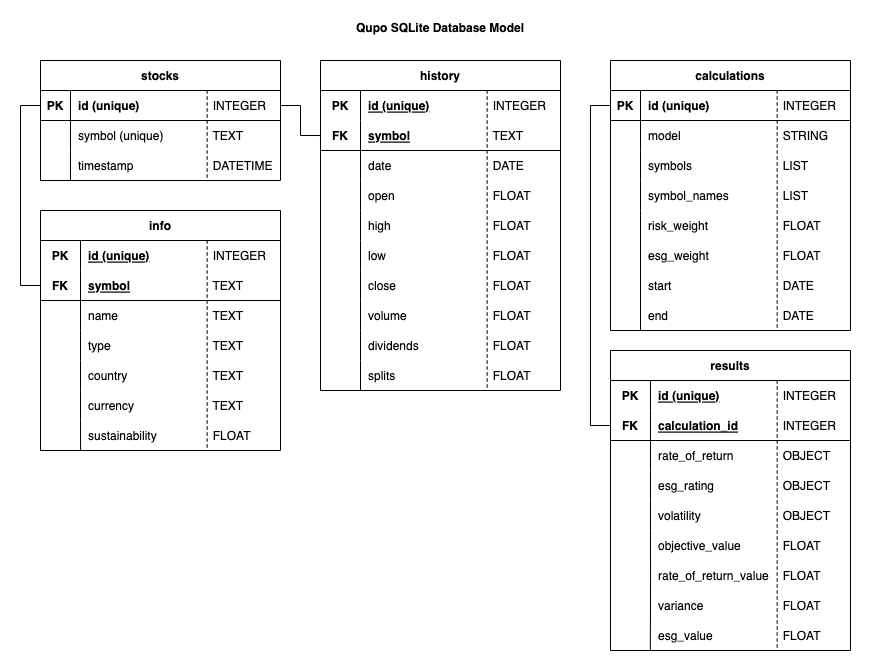
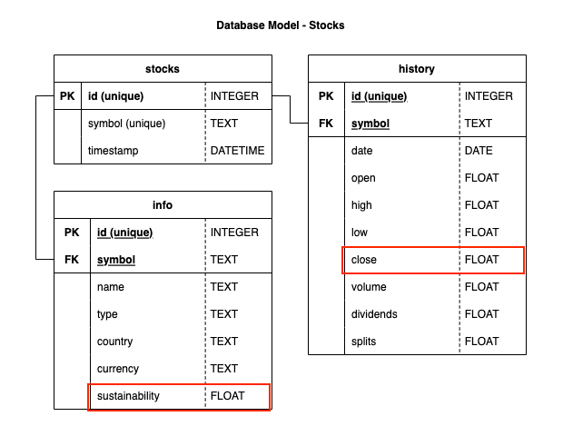

# Database

The Qupo application initiates a SQLite database on start-up when the config parameter `use_db` is set to `True`. It uses a local database file and saves stock data as well as the results of calculated models. It minimizes the loading time of the application.

## Model Structure

There are two database models created, one for the stocks and one for the calculations. The tables of these two models are not connected with each other. The following image shows the whole model structure:

### Stocks Database Model Structure

### Calculations Database Model Structure

